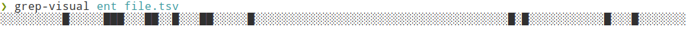
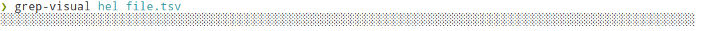
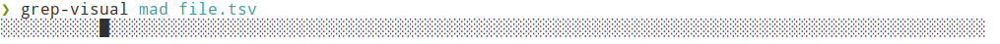

# Grep visually

> Visually locate an occurence in a file

 
### Install

    git clone git@github.com:edouard-lopez/grep-visual.git
    cp grep-visual/grep-visual.bash ~/.local/bin/

### Usage

    grep-visual par file.tsv

### Preview

##### No match

##### Single match

##### Multiple matches

##### Regex/Glob
> Regular expressions are the extended kind found in `egrep`.

### Under the hood

This is powered by the `awk` on your machine.

### License

> [MIT LICENSE](LICENSE)